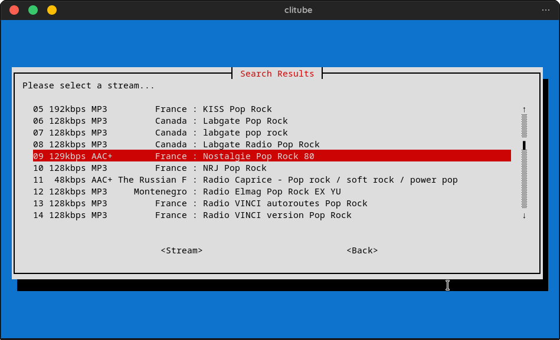

# terminal-utilities
A few assorted utilities to be used on a command line.

## tube-play

`tube-play` needs a few packets to be installed.

· ffmpeg

· yt-dlp

· mpv

`tube-play` plays the audio track from a youtube link provided as the first argument.

## clitube

`clitube` allows you to swiftly play music from various different sources. I still use my 8 year old celeron laptop to do some of my work and it works perfectly well.

You will be able to select from various sources 

`clitube` searches for the searchterm you provided, selecting the first 15 ( this is user configurable ) entries from the search results.

The user selected video is then played ( sound only ) through the selected media player ( in my case `nvlc` ).

The same is possible searching for internet radio stations

...and for local music as well

`clitube` needs the following mandatory packets to be installed.

· whiptail

· yt-dlp

· jq ( allows to extract the json data from radio browser )  

Apart from these packets you need to install the media players you want to use with the script.
I use `nvlc` ( this is the ncurses version of vlc, contained in the same package ) for youtube and radios and `kew` for local music playback, but you can use anything as long as it is compatible with the stream of file you are playing back. `ffplay` works great for stream playback (but I don't like the lack of a certain GUI ) and `cmus` works great for local music ( I prefer `kew` due to the ability to display covers ). You choose... 

`clitube` allows to search youtube for videos and permits to play them, all from the command line

Installing all neccessary dependencies under Debian is accomplished by
`sudo apt install jq yt-dlp`
Note that the non-free repo has to be activated.

## embed_icon

Is a script to embed svg image data into markdown documents. I use it in Joplin to embed SVG images directly.
